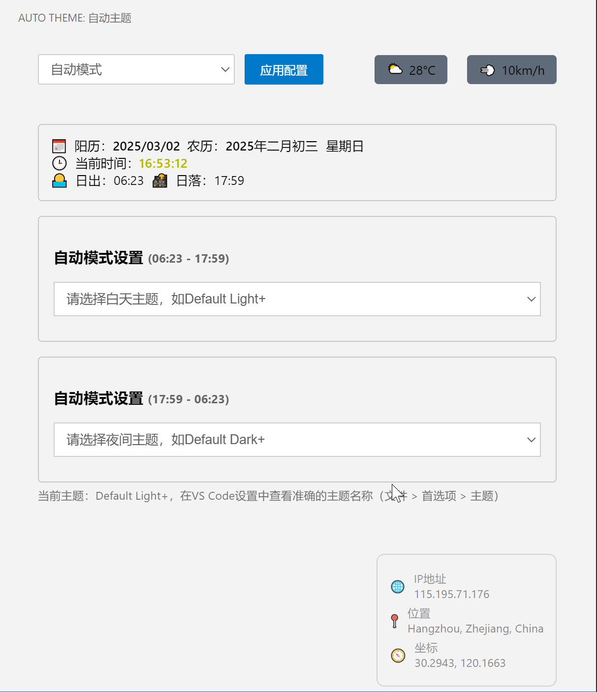
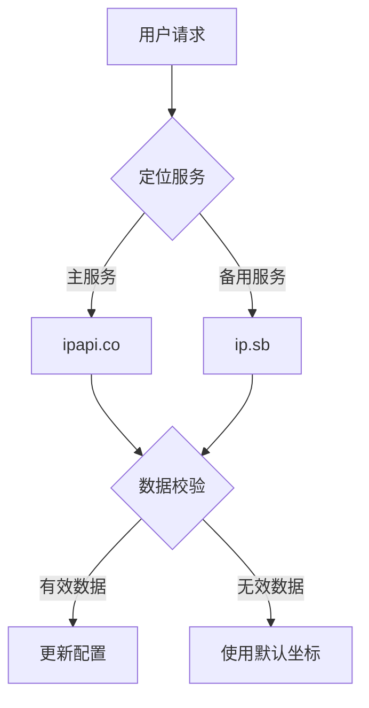

# 🌓 Auto Theme - 智能主题切换插件

[](https://code.visualstudio.com/)
[](https://opensource.org/licenses/MIT)
[](https://github.com/yourname/auto-theme/releases)

智能切换VS Code主题的扩展工具，基于地理位置、日出日落时间和实时天气自动适配最佳编辑环境。



## ✨ 核心功能

### 🌗 智能主题切换
- 🕒 基于本地时间的自动切换
- 🌍 地理位置感知（IP定位+GPS备用）
- 🌅 动态计算日出日落时间
- ⚡ 智能调度系统（最优性能）
- 🔄 配置自动保存（重启后恢复）

### 🌤️ 环境感知
- ☀️ 实时天气集成（温度/风速/天气状况）
- 🗓️ 农历日期显示
- 📍 多源定位服务（智能切换+错误回退[ipapi.co](https://ipapi.co/json/) + [api.ip.sb/geoip](https://api.ip.sb/geoip)）


### 🛠️ 高级配置
```jsonc
"autoTheme.mode": "auto", // [auto|manual]
"autoTheme.dayTheme": "Default Light+",
"autoTheme.nightTheme": "Default Dark+",
"autoTheme.manualLocation": { "lat": 39.9042, "lng": 116.4074 }
```

## 🚀 快速开始

### 安装方式

1. **应用市场安装**

   - VS Code扩展商店搜索 `Auto Theme`
   - 点击安装按钮

2. **手动安装**

   ```bash
   git clone https://github.com/yourname/auto-theme.git
   cd auto-theme
   vsce package
   code --install-extension auto-theme-0.1.0.vsix
   ```

### 使用指南

1. 打开命令面板 (`Ctrl+Shift+P`)
2. 运行 `Auto Theme: Enable` 启用插件
3. 点击状态栏图标打开控制面板
4. 选择工作模式：
   - 🌞 白天模式：使用浅色主题
   - 🌙 夜间模式：使用深色主题
   - 🤖 自动模式：根据地理位置自动切换

## ⚙️ 配置参考

| 配置项                  | 类型    | 默认值         | 说明                                    |
| :---------------------- | :------ | :------------- | :-------------------------------------- |
| `autoTheme.mode`        | string  | "auto"         | 工作模式 [auto｜manual]                 |
| `autoTheme.dayTheme`    | string  | "Default Light+" | 白天主题                                |
| `autoTheme.nightTheme`  | string  | "Default Dark+" | 夜间主题                                |
| `autoTheme.precision`   | number  | 300            | 检测间隔(秒)                            |
| `autoTheme.weatherUnit` | string  | "metric"       | 温度单位（metric/imperial）             |
| `autoTheme.enableLunar` | boolean | true           | 是否显示农历                            |
| `autoTheme.manualLocation` | object | null         | 手动设置坐标 { lat: 39.9, lng: 116.4 }  |

## 🌍 定位服务架构



## 🛠️ 开发指南

### 环境要求

- Node.js >= 16.x
- VS Code API >= 1.75
- TypeScript >= 4.7

### 构建步骤

```bash
npm install
npm run compile
npm run watch  # 开发模式
```

## ❓ 常见问题

### 定位服务失效？

1. 检查网络连接

2. 尝试手动设置坐标：

   ```json
   "autoTheme.manualLocation": {
     "lat": 39.9042,
     "lng": 116.4074
   }
   ```

### 主题未生效？

1. 确认主题名称与已安装主题完全一致

2. 检查控制台日志：

   ```bash
   code --logExtensionHost
   ```

## 📄 License

MIT License © 2024 [Vogadero]

